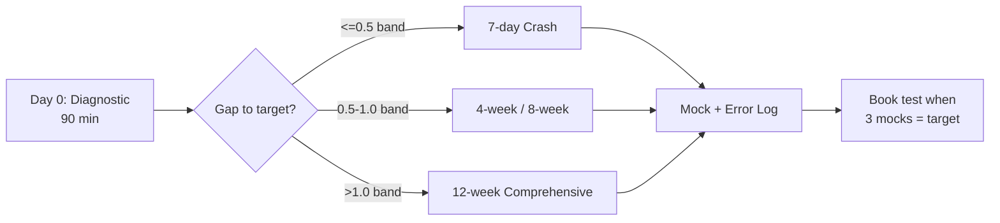

# IELTS Study Tutor — Best Sources + How to Study

> The advanced, no-fluff system to go from Band 6.0 → 7.5+ in Listening, Reading, Writing & Speaking. Curated sources, proven study plans, and a complete AI + human tutor framework. For IELTS Academic & General Training.

<p>
  <a href="https://github.com/Flynntaggart26/ielts-study-tutor"></a>
  
  
  
  
  
  
</p>

**Stop wasting weeks on random PDFs and YouTube.** This repo answers 3 questions in order:

1. **What should I use?** → 40+ sources tested, ranked, with free/paid + level labels.
2. **How should I study?** → Diagnostic → plan → deliberate practice → feedback loop.
3. **Who corrects me?** → Copy-paste AI prompts + human tutor lesson plans + checklists.

No pirated tests. Links only. Everything actionable in ≤90-minute sessions.

---

## Table of Contents

- [Who Is This For?](#-who-is-this-for)
- [Start Here in 5 Minutes](#-start-here-in-5-minutes)
- [What You Get](#-what-you-get)
- [Top Sources TL;DR](#-top-sources-tldr)
- [Choose Your Study Path](#-choose-your-study-path)
- [The Study Method](#-the-study-method)
- [Repository Structure](#-repository-structure)
- [Skills at a Glance](#-skills-at-a-glance)
- [Tutor System](#-tutor-system)
- [Track Progress](#-track-progress)
- [Band Score Map](#-band-score-map)
- [FAQ](#-faq)
- [Contributing](#-contributing)
- [License](#-license)

---

## 🎯 Who Is This For?

| You are... | Use this repo to... | Start with |
|------------|---------------------|------------|
| **Self-learner B1-B2 (Band 4.5-6.0)** | Build foundations without overwhelm | `study-plans/12-week-comprehensive.md` |
| **Stuck at 6.0-6.5, need 7.0+** | Fix Writing/Speaking caps with feedback | `study-plans/4-week-band-6-to-7.md` |
| **Busy worker (1-2h/day)** | Follow a time-boxed system | `tutor/how-to-study-guide.md` + `templates/weekly-planner.md` |
| **Tutor / study partner** | Run structured 60/90-min lessons | `tutor/tutor-framework.md` |
| **1 week to exam** | Maximize current level, fix technique | `study-plans/crash-7-days.md` |

Academic and General Training share Listening/Speaking. Reading/Writing differences are flagged in `skills/` guides.

---

## 🚀 Start Here in 5 Minutes



**Do this now:**

1. **Diagnose (90 min):** 1x Listening Part 1-2 + 1x Reading passage + 1x Task 2 essay (40 min) + 1x 2-min Speaking recording. Score with [`study-plans/self-assessment.md`](study-plans/self-assessment.md).
2. **Pick a plan (2 min):** See [Choose Your Study Path](#-choose-your-study-path) below.
3. **Install only Top 5 sources:** Open [`sources/best-sources.md`](sources/best-sources.md). Do not download 20 PDFs.
4. **Set up feedback:** Copy 1 prompt from [`tutor/ai-tutor-prompts.md`](tutor/ai-tutor-prompts.md) into ChatGPT/Claude.
5. **Track:** Duplicate [`templates/weekly-planner.md`](templates/weekly-planner.md) and log Day 0 in [`templates/study-tracker.csv`](templates/study-tracker.csv).

> Rule: no new sources after Week 3. Only Cambridge mocks + your error log.

---

## ✨ What You Get

### Part 1 — Best Sources for IELTS (curated, rated)

- **Tier 1 Official:** Cambridge 10-19, Official Guide, IDP/British Council mocks — ranked by authenticity
- **Books by level:** B1 → B2 → C1 → C2 roadmap so you buy 2 books, not 12 — [`sources/books-by-level.md`](sources/books-by-level.md)
- **Websites & apps:** how to use each (IELTS Liz, Simon, Road to IELTS, Write & Improve, Anki) — [`sources/websites-apps.md`](sources/websites-apps.md)
- **YouTube & podcasts:** 5 examiner-led channels + daily listening diet — [`sources/youtube-podcasts.md`](sources/youtube-podcasts.md)
- **Practice tests:** where to take real CBT/paper mocks + scoring protocol — [`sources/practice-tests.md`](sources/practice-tests.md)
- **Machine-readable:** all sources as JSON for apps/flashcards — [`data/sources.json`](data/sources.json)

### Part 2 — How to Study + Tutor System

- **Core method:** 90-min Diagnose → Input → Practice → Feedback loop — [`tutor/how-to-study-guide.md`](tutor/how-to-study-guide.md)
- **4 ready plans:** 7-day crash, 4-week (6.0→7.0), 8-week (B2→7.5), 12-week (B1→7.5)
- **7 skill guides:** Listening, Reading, Writing Task 1/2, Speaking, Vocabulary, Grammar with drills and time systems
- **AI tutor:** 6 copy-paste prompts for Writing correction, Speaking coaching, Reading explainer — [`tutor/ai-tutor-prompts.md`](tutor/ai-tutor-prompts.md)
- **Human tutor:** diagnostic script, 60/90-min lesson templates, homework policy — [`tutor/tutor-framework.md`](tutor/tutor-framework.md)
- **Templates:** checklists, self-evaluation sheets, CSV tracker — [`templates/`](templates/)

---

## 🏆 Top Sources TL;DR

| ★ | Source | Best For | Cost | Level |
|---|--------|----------|------|-------|
| ★★★★★ | Cambridge IELTS 15-19 + Official Guide | Real mocks, gold standard | Paid / library | B1-C2 |
| ★★★★★ | [IELTS Liz](https://ieltsliz.com) | Free strategy + Task 1/2 models | Free | B1-C1 |
| ★★★★☆ | [E2 IELTS](https://www.youtube.com/@E2IELTS) / [IELTS Advantage](https://www.youtube.com/@IELTSAdvantage) | Walkthroughs, Band 7+ Writing | Free | B2-C1 |
| ★★★★☆ | [Write & Improve](https://writeandimprove.com) + Road to IELTS | Instant Writing feedback + CBT UI | Free / freemium | B1-C1 |
| ★★★★☆ | Anki + Academic Word List + BBC 6 Minute English | Vocab retention + daily listening | Free | All |

Full 40+ list with ratings, Academic/General labels, and avoid-list: [`sources/best-sources.md`](sources/best-sources.md).

---

## 🗺️ Choose Your Study Path

| Plan | Time | Hours/day | Target jump | File |
|------|------|-----------|-------------|------|
| **7-Day Crash** | 1 week | 3h | Hold score, fix technique | [`study-plans/crash-7-days.md`](study-plans/crash-7-days.md) |
| **4-Week 6.0→7.0** | 4 weeks | 2-3h | +0.5-1.0 band, technique focus | [`study-plans/4-week-band-6-to-7.md`](study-plans/4-week-band-6-to-7.md) |
| **8-Week Zero to Hero** | 8 weeks | 1.5-2h | B2 → 7.0-7.5 structured | [`study-plans/8-week-zero-to-hero.md`](study-plans/8-week-zero-to-hero.md) |
| **12-Week Comprehensive** | 12 weeks | 1-2h | B1 → 7.0-7.5 foundations first | [`study-plans/12-week-comprehensive.md`](study-plans/12-week-comprehensive.md) |

**How to decide:** gap ≤0.5 → Crash. Gap 0.5-1.0 → 4- or 8-week. Gap >1.0 or grammar/vocab weak → 12-week. Don't book until 3 consecutive timed mocks hit target.

Example week (10-12h, working adult):

| Day | 90 min focus |
|-----|--------------|
| Mon | Listening Parts + 10 Anki |
| Tue | Writing Task 2 timed + correction |
| Wed | Reading passage timed + grammar |
| Thu | Speaking recorded (Part 2/3) |
| Fri | Writing Task 1 + rewrite |
| Sat | Mock (alternate weeks) + error-log review |
| Sun | Rest or podcast + Anki |

---

## 🧠 The Study Method

```
Diagnose → Focused Input (20m) → Deliberate Practice timed (45m) → Feedback <24h (15m) → Spaced Review (10m) → Mock weekly
```

**5 rules that move your band:**

1. **80/20:** Task 2 + Speaking Part 2/3 decide your band. Give them 50% of time.
2. **Feedback within 24h:** uncorrected essays/recordings don't improve. AI daily + human weekly.
3. **Error log > hours:** every session ends with *why* you missed it (vocab / grammar / time / trick).
4. **Timed from Week 2:** untimed practice after Week 2 builds false confidence.
5. **One weakness at a time:** fix articles for 7 days straight, not 7 things in 1 day.

Full session template, weekly rhythm, and readiness checklist: [`tutor/how-to-study-guide.md`](tutor/how-to-study-guide.md).

Common Band 6 caps to check before every mock: [`tutor/common-mistakes.md`](tutor/common-mistakes.md).

---

## 🗂️ Repository Structure

```text
ielts-study-tutor/
├── sources/
│   ├── best-sources.md       # master list — start here
│   ├── books-by-level.md     # B1→C2 buying guide
│   ├── websites-apps.md      # how to use each site/app
│   ├── youtube-podcasts.md   # channels + listening diet
│   └── practice-tests.md     # where + how to mock
├── skills/
│   ├── listening.md          # prediction + paraphrase + transfer
│   ├── reading.md            # T/F/NG, headings, time system
│   ├── writing-task-1.md     # 4-para Academic report
│   ├── writing-task-2.md     # 4-5 para essay, Band 7+ structure
│   ├── speaking.md           # Parts 1-3 tactics + drills
│   ├── vocabulary.md         # collocations + Anki system
│   └── grammar.md            # 7 high-ROI structures
├── study-plans/
│   ├── self-assessment.md    # Day 0 diagnostic
│   ├── crash-7-days.md
│   ├── 4-week-band-6-to-7.md
│   ├── 8-week-zero-to-hero.md
│   └── 12-week-comprehensive.md
├── tutor/
│   ├── how-to-study-guide.md # core 90-min loop
│   ├── ai-tutor-prompts.md   # 6 copy-paste prompts
│   ├── tutor-framework.md    # lesson plans for humans
│   ├── feedback-templates.md # correction sheets
│   └── common-mistakes.md    # Band 6 cap list
├── templates/
│   ├── weekly-planner.md
│   ├── study-tracker.csv
│   ├── writing-checklist.md
│   └── speaking-self-evaluation.md
├── data/sources.json
├── .github/
├── CONTRIBUTING.md
└── LICENSE
```

---

## 📚 Skills at a Glance

| Skill | Time | Pass mark habit | Guide |
|-------|------|-----------------|-------|
| Listening (30m, 40Q) | 30% | Predict answer type, listen for paraphrase, check plurals/limits | [`skills/listening.md`](skills/listening.md) |
| Reading (60m, 40Q) | 25% | 17/20/23 min split, guess + move after 2 min | [`skills/reading.md`](skills/reading.md) |
| Writing Task 1 (20m, 150+) | 15% | Overview with no data + grouped comparisons | [`skills/writing-task-1.md`](skills/writing-task-1.md) |
| Writing Task 2 (40m, 250+) | 25% | Clear position, 2 developed bodies, 60% complex sentences | [`skills/writing-task-2.md`](skills/writing-task-2.md) |
| Speaking (11-14m) | daily 15m | Answer + reason + example, fill 2 min in Part 2 | [`skills/speaking.md`](skills/speaking.md) |
| Vocab + Grammar | 15m/day | 10 collocations/day, articles → SVA → tenses first | [`skills/vocabulary.md`](skills/vocabulary.md), [`skills/grammar.md`](skills/grammar.md) |

---

## 🤝 Tutor System

**Self-study + AI (daily, free):**

```text
Write timed → self-checklist → paste into Write & Improve →
paste AI prompt (tutor/ai-tutor-prompts.md) → rewrite weakest paragraph by hand
```

**Human tutor / partner (1-2x/week):**

- Use [`tutor/tutor-framework.md`](tutor/tutor-framework.md): diagnostic script, 60-min Writing / 60-min Speaking / 90-min mock-review templates.
- Correct with [`tutor/feedback-templates.md`](tutor/feedback-templates.md): max 5 patterns/session, student self-corrects, ends with 1 win + 2 actions.
- Homework rule: no rewrite = no new task. 2 essays + 3 recordings/week minimum.

This combo (AI daily + human weekly) is the fastest progress per cost to 7.5.

---

## 📊 Track Progress

- **Daily:** log in [`templates/study-tracker.csv`](templates/study-tracker.csv) — `date, skill, task, score, error_pattern, fix`.
- **Weekly:** copy [`templates/weekly-planner.md`](templates/weekly-planner.md), list top 3 error patterns, adjust next week.
- **Before submitting Writing:** run [`templates/writing-checklist.md`](templates/writing-checklist.md) (word count? position? complex sentences? articles?).
- **After Speaking:** fill [`templates/speaking-self-evaluation.md`](templates/speaking-self-evaluation.md) (pauses? collocations? 1 sentence to upgrade?).

Re-test every 2 weeks under identical timed conditions. If no +0.5 in 6 weeks at 8h/week, you need more feedback, not more hours.

---

## 📈 Band Score Map

| Band | Listening /40 | Reading Acad. /40 | Writing | Speaking |
|------|---------------|-------------------|---------|----------|
| 6.0 | 23-25 | 23-26 | Addresses task, frequent errors, limited cohesion | Fluent with pauses, simple linkers |
| 7.0 | 30-31 | 30-32 | Clear position, less common vocab, occasional errors | Flexible vocab, complex sentences with slips |
| 7.5+ | 33+ | 33+ | Wide range, natural cohesion, rare errors | Natural, precise, native-like collocations |

> ~150-200 focused hours per 0.5 band with feedback. 4-6 weeks at 2h/day is realistic for 6.0→6.5.

---

## 🙋 FAQ

**Academic or General?** Listening/Speaking identical. Reading differs (General has ads/notices + one long text). Writing Task 1 differs (General = letter, Academic = chart/process/map). Skill guides flag both.

**Can I do it free to Band 7?** Yes. Cambridge from library + IELTS Liz + E2 + Anki + Write & Improve is enough. Pay for human correction only for 7.5+ Writing polish.

**How many mocks?** B1-B2: 1 per 2 weeks. B2-C1: 1/week. Last 2 weeks: 2/week. Always review fully next day — unreviewed mocks waste time.

**When to book?** 3 consecutive timed mocks at target (±0.5), Writing corrected to target twice, 5 Speaking self-evaluations at target.

**Paper or computer?** Same content. Computer is faster for slow handwriters, paper is easier for highlighting/notes. Practice in your test interface (see `sources/practice-tests.md`).

---

## 🤲 Contributing

Found a better source, fixed a broken link, improved a plan? See [`CONTRIBUTING.md`](CONTRIBUTING.md).

- New source must include: name, URL, cost, level, Academic/General, why it beats its Tier equivalent.
- No full Cambridge PDFs (links only), no “guaranteed Band 8” spam.
- Small PRs merge fastest. Template: [`.github/PULL_REQUEST_TEMPLATE.md`](.github/PULL_REQUEST_TEMPLATE.md).

---

## 📄 License

MIT — see [LICENSE](LICENSE). Official IELTS content belongs to Cambridge / IDP / British Council. This repo curates links and original guides; it does not redistribute copyrighted tests.

---

⭐ If this helped you, **star the repo** and open a Discussion with your starting → target → achieved band. It helps others choose plans.
